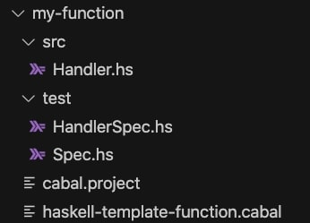
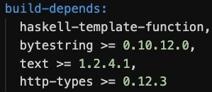

# Developing in Haskell
Here you will find a Haskell template to start developing functions working with the HTTP protocol.

## Making a Function
In order to interact with HTTP protocol, we need to use the `haskell-http` function template:
```
faas-cli template pull git@github.com:stackbuilders/haskell-faas-template.git
```
This will pull all the templates available in the Stackbuilders repository.

Then, we will create a new haskell function using:
```
faas-cli new --lang haskell-http <my-function>
```
Replace the `<my-function>` with a descriptive name for your function.

Now, we will get a description of our project in the `<my-function>.yml` file. The `<my-function>` directory contains the necessary resources to implement our "lambda" function. It should look like this:



Inside the `<my-function>` directory we will find:
- `cabal.project`: Here you can import libraries that are not present in [Hackage](https://hackage.haskell.org/) (i.e. custom libraries)
- `haskell-template-function.cabal`: Here you will import the libraries needed in order to build the function. You can import libraries inside the `build-depends` section like this:

    

- `src`: In this directory you will find the `Handler.hs`. This is the "main" module for your FaaS function. This is the module responsible for taking the input and outputting the response.
- `test`: Directory with the `HandlerSpec.hs` file. Here you can use the `Hspec` library to write tests for your function.

##Note:
We have used an oficial image from Docker to create a personalized one to harbor the needed precompiled dependencies. It is possible to visualize it at the next repository: [https://github.com/stackbuilders/haskell-faas-template]
